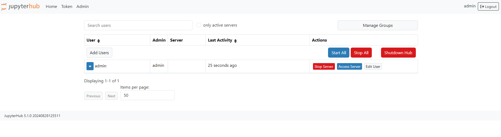
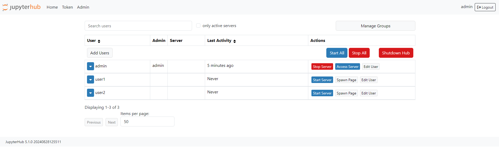

# docker-jupyterhub-multiuser
Default build multiuser JupyterHub for Docker

### Installation:
```
git clone https://github.com/B3SSS/docker-jupyterhub-multiuser.git
```

### Start:
```
cd docker-jupyterhub-multiuser
docker-compose up
```

### Initial settings:
Initially, the user <strong>admin</strong> is available, which is the JupyterHub administrator. It is enough to create a user with this name and log in. 

### Creating Users:
1. Go to <strong>/hub/admin</strong> and click <strong>Add users</strong> 

2. Enter username (or usernames on a separate line) and click <strong>Add users</strong> 

3. Users have been added. Once registered, they will be able to use JupiterHub 